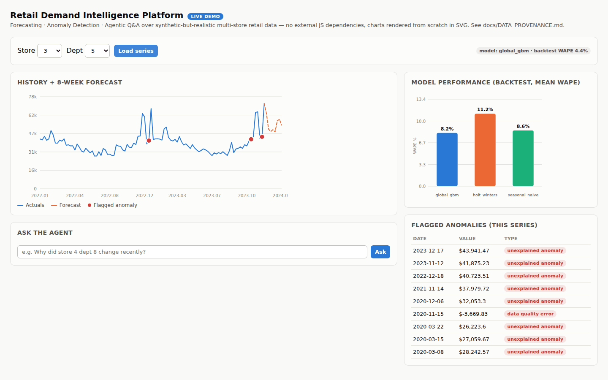

# Retail Demand Intelligence Platform

**Forecasting + anomaly detection + a tool-calling agent with a full audit trail, for a simulated multi-store retail chain , built to demonstrate senior ML/AI engineering practice, not tutorial-following.**




*Live interaction: load a series, ask the agent a question in plain English, expand the audit trail to see exactly which tool it called and why. No Chart.js, no CDN , the charts are hand-rolled SVG.*

## Why this isn't just another forecasting notebook

- **Every number in the docs is real, not cherry-picked** , the gradient-boosted model beats seasonal-naive by less than half a point of WAPE and only wins 140/240 series; the report says so instead of rounding up. See `docs/EVAL_REPORT.md`.
- **A real bug, found and fixed, is documented rather than hidden** , an early version of the anomaly detector mislabeled December holiday spikes as anomalies; the fix and the before/after numbers are in the eval report.
- **Forecasts ship with an 80% prediction interval, and the interval's own coverage is honestly measured** , a held-out check reports 74.7% actual coverage vs. 80% nominal, not asserted-and-forgotten. See `docs/EVAL_REPORT.md` §4.
- **Explainability without SHAP, disclosed as an approximation, not passed off as SHAP** , occlusion-based local attribution + permutation-importance global ranking, since `shap` wasn't installable in this build sandbox. See `src/explain.py`.
- **A genuine what-if simulator, clearly separated from the read-only tools** , `simulate_scenario` recomputes the forecast under a hypothetical markdown/holiday live, rather than reading a precomputed CSV like every other agent tool does.
- **Every agent answer carries a full audit trail** , not just "trust the AI," but which tool it called, with what arguments, and why (`reports/agent_traces.jsonl`).
- **The LLM backend is a swappable brain, not a hard-coded vendor call** , a deterministic mock by default, with real tool-calling loops against Anthropic, OpenAI, and AWS Bedrock (whichever API key / model ID is present), sharing one tool registry and trace format. Set `ANTHROPIC_API_KEY`, `OPENAI_API_KEY`, `BEDROCK_MODEL_ID`, or `LLM_BACKEND=anthropic|openai|bedrock` to force one.
- **A full AWS deployment, not just a diagram of one** , `infra/` has real Terraform (S3, IAM, Lambda, API Gateway, EventBridge, SageMaker Processing + optional Serverless Inference, CloudWatch, Secrets Manager) and real integration code (a Lambda/API-Gateway WSGI adapter, a SageMaker Processing entrypoint), with test coverage against mocked AWS calls , honestly marked as unvalidated against a live AWS account (no AWS network access in this build sandbox). See `infra/README.md`.
- **Mapped explicitly to five real job descriptions** it was built against (Merciv, Uber Freight, Sigma, Confido, Condor) , see `docs/JOB_MAPPING.md` for the requirement-by-requirement crosswalk.
- **Runs in one command** , `docker build -t retail-intel . && docker run -p 8000:8000 retail-intel` , with CI (`.github/workflows/tests.yml`) running the full pipeline and test suite on every push.

**This is not a notebook.** It's a pipeline (data → features → rolling-origin
backtest → model selection → anomaly detection → agent tools → API → dashboard),
with tests, a monitoring simulation, and an honest write-up of what's real, what's
simulated, and what's a known limitation.

## What it does

1. **Forecasts** next-8-week demand for 240 store/department series, competing
   three models (seasonal-naive, Holt-Winters, a global gradient-boosted model)
   against each other via **rolling-origin backtesting** and picking a winner
   *per series* , not a single train/test split, which can flatter or sink a
   model purely by luck of which weeks land in the holdout.
2. **Flags anomalies** , data-entry errors, unexplained demand shocks , while
   explicitly separating out spikes that are already explained by an active
   promotion or a known calendar holiday, so it doesn't cry wolf on things a
   human would immediately recognize as normal.
3. **Quantifies its own uncertainty and explains its own reasoning** , every
   forecast ships an 80% prediction interval with honestly-measured
   coverage, and any series where the gradient-boosted model won can be
   explained (which features drove this specific number) or interrogated
   with a live what-if ("what if we ran a markdown promo these next 3
   weeks?").
4. **Answers natural-language questions** ("why did store 4 dept 8 change
   recently?", "what are the biggest declines?") through a small tool-calling
   agent, with a full reasoning/audit trail behind every answer.
5. **Monitors itself, and closes the loop** , a drift-detection pass flags
   individual series for a retraining review even when the fleet-wide
   average looks fine, and `scripts/retrain_flagged.py` actually acts on
   that list: re-checking each flagged series' three candidate models
   against the latest data and re-selecting the winner when it's changed,
   with every decision (changed or not) logged to
   `reports/retraining_log.jsonl` , not just a table nobody reads.
6. Serves all of this through a **Flask API + browser dashboard**, with the
   forecast chart shading its own confidence band and dedicated panels for
   feature drivers and the what-if simulator.

## Quickstart

**Option A , Docker (one command):**

```bash
docker build -t retail-intel .
docker run -p 8000:8000 retail-intel
# then open http://localhost:8000
```

The image bakes data generation + the full backtest/anomaly/monitoring pipeline
in at build time, so the container starts instantly with a reproducible,
versioned snapshot of results , see the `Dockerfile`.

**Option B , locally:**

```bash
pip install -r requirements.txt

# 1. generate the (synthetic) dataset -- see docs/DATA_PROVENANCE.md
python data/generate_data.py

# 2. run the full offline pipeline: backtest, anomaly scan, forward forecasts
python scripts/run_pipeline.py

# 3. simulate production monitoring against the backtest history
python scripts/run_monitoring_sim.py

# 4. close the loop: re-select models for any series monitoring flagged for drift
python scripts/retrain_flagged.py

# 5. regenerate the report figures
python scripts/make_report_figures.py

# 6. run the tests
python -m unittest discover -s tests -v

# 7. start the API + dashboard
python app/server.py
# then open http://localhost:8000
```

## Repo layout

```
data/               synthetic data generator + generated CSVs + ground-truth event log
src/                 the actual pipeline: features, forecasting, backtest, anomaly, agent,
                     intervals (prediction intervals), explain (occlusion/permutation
                     importance), scenario (what-if simulation)
scripts/             orchestration entry points (pipeline, monitoring sim, figures, demo assets)
app/                 Flask API + HTML/JS dashboard (zero external JS dependencies)
tests/               unittest suite (pytest wasn't installable in the build sandbox)
reports/             generated artifacts: metrics CSVs, figures, agent trace log,
                     interval_coverage.json, feature_importance.json, models/*.joblib
docs/                ARCHITECTURE.md, EVAL_REPORT.md, DATA_PROVENANCE.md, JOB_MAPPING.md, polished report
infra/               AWS deployment: Terraform IaC, Lambda/API-Gateway adapter, SageMaker
                     Processing entrypoint + optional Serverless Inference endpoint -- see
                     infra/README.md
.github/workflows/   CI: runs the full pipeline + test suite + API smoke test on every push
Dockerfile           one-command reproducible run
```

## Key results (from the actual backtest, not cherry-picked)

| Model | Mean WAPE (backtest) | Series won (of 240) |
|---|---|---|
| Global gradient-boosted model | 7.9% | 154 |
| Seasonal-naive | 8.6% | 77 |
| Holt-Winters (fixed-parameter) | 11.2% | 9 |

(These are the numbers from the exact `reports/*.csv` checked into this repo,
regenerated by re-running `scripts/run_pipeline.py` against the same
synthetic dataset. Re-running the pipeline on a different machine/sklearn
version can shift the GBM's win count by single-digit percentages ,
`HistGradientBoostingRegressor`'s fixed `random_state` guarantees
repeatable results *within* one environment/library version, not
necessarily bit-identical results *across* different ones; see
`docs/EVAL_REPORT.md`'s note on this.)

Seasonal-naive winning 77/240 series is a real, honest result, not a bug , some
series are dominated by strong, low-noise annual seasonality where "same week
last year" is genuinely hard to beat. See `docs/EVAL_REPORT.md` for the full
breakdown, limitations, and what a next iteration would change.

## Using real data instead of the synthetic set

See the module docstring in `data/generate_data.py` , the pipeline is fully
schema-driven, so dropping in the real Walmart/M5/Favorita Kaggle CSVs (renamed
to match the documented schema) requires no changes to `src/`.

## Deploying to AWS

`infra/` deploys this same platform onto SageMaker (nightly batch pipeline
+ optional Serverless Inference endpoint), Bedrock (a fourth pluggable LLM
backend), and Lambda + API Gateway (the API layer) via Terraform. See
`infra/README.md` for the architecture, step-by-step deployment
instructions, a rough cost estimate, and an explicit list of what's
verified by this repo's test suite versus what's written-to-spec but not
yet run against a live AWS account.
