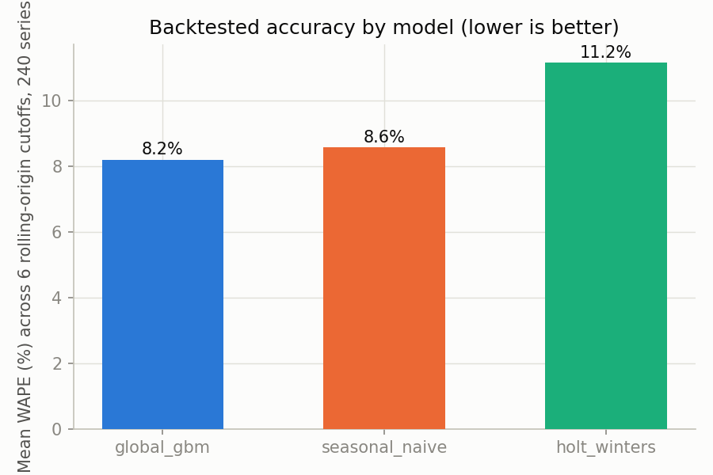
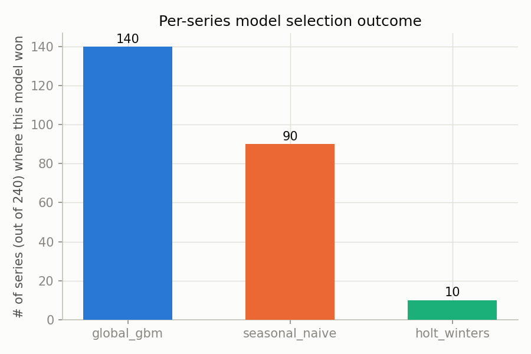
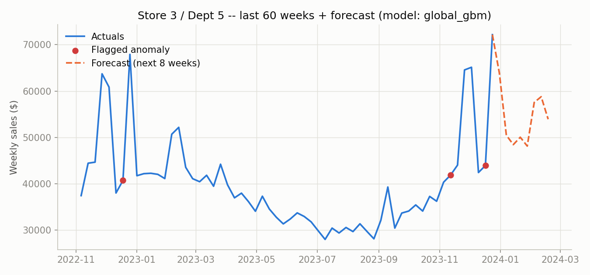
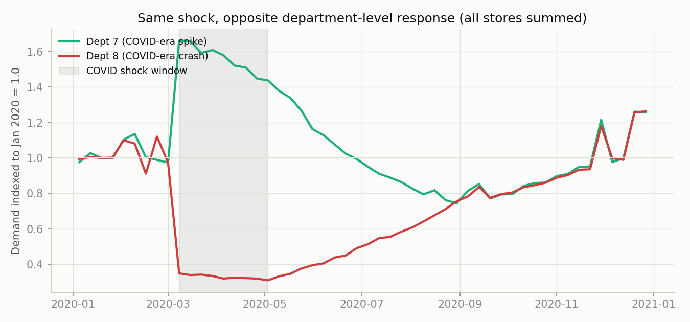
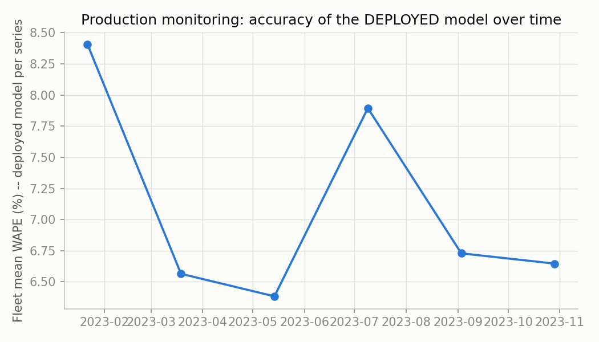

# Evaluation Report

All numbers below come directly from `reports/*.csv`, generated by
`python scripts/run_pipeline.py` followed by `python scripts/run_monitoring_sim.py`
and `python scripts/make_report_figures.py`. Nothing here is hand-picked or
rounded favorably — this is what the pipeline actually produced.

## 1. Forecasting: rolling-origin backtest

**Method:** 6 rolling-origin cutoffs spaced 8 weeks apart across the last ~48
weeks of the 5-year synthetic history, forecasting 8 weeks ahead from each
cutoff, for all 240 (store, department) series. Three models compete:
seasonal-naive, Holt-Winters (fixed-parameter, see `docs/ARCHITECTURE.md`),
and a global gradient-boosted model trained fresh at each cutoff on
everything strictly before it.

| Model | Mean WAPE | Median WAPE | Std WAPE | Mean MAPE | Series won (/240) |
|---|---|---|---|---|---|
| Global GBM | **8.21%** | 7.08% | 3.68% | 9.30% | **140** |
| Seasonal-naive | 8.58% | 7.63% | 2.84% | 9.50% | 90 |
| Holt-Winters | 11.16% | 10.16% | 3.58% | 12.26% | 10 |

**Reading this honestly:** the global GBM wins on more series and has the
best mean WAPE, but by less than half a point over seasonal-naive — and
seasonal-naive still wins outright on 90/240 series (37.5%). Those are
overwhelmingly series with strong, low-noise annual seasonality where "same
week last year" is close to the ceiling of what's predictable, and a more
flexible model's extra variance costs more than it's worth. This is *why*
the pipeline selects per series instead of globally: a system that always
deployed the GBM everywhere would be quietly worse on over a third of the
series than the one built here.

Holt-Winters' weaker showing traces directly to the documented substitution
in `docs/ARCHITECTURE.md`: fixed smoothing constants (a small grid search)
instead of MLE-fit ones. That's a real, disclosed cost, not a hidden one.

**Example series** (Store 3 / Dept 5, global GBM selected, backtest WAPE 4.4%):

## 2. Anomaly detection

| Category | Count (of 48,960 series-weeks) |
|---|---|
| Normal | 45,028 |
| Unexplained anomaly (needs investigation) | 2,653 |
| Explained — holiday spike | 895 |
| Explained — promo/markdown spike | 323 |
| Data quality error (negative/implausible) | 61 |
| High-confidence (statistical + IsolationForest agree) | 473 |

**Validation against the generator's known ground-truth events**
(`python scripts/run_anomaly_scan.py`):

- **Localized supply disruption** (Store 4, Dept 8, 5-week window,
  no promo/holiday/COVID cause): **4 of 5 weeks** flagged as needing
  investigation.
- **Data-entry errors** (negative sales rows): **61/61 (100%)** flagged as
  `data_quality_error`.
- **COVID crash window** (Mar–May 2020): **211 of 240 series** had at least
  one flagged week — consistent with a shock whose *sign and magnitude*
  varies by department (see below), so not every series crosses the
  detection threshold, which is expected and correct, not a miss.
- **Promo-driven spikes**: 323 correctly separated into "explained," never
  raised as something to investigate.

**The COVID regime shift, and why a single global "shock multiplier" would
have missed half of it:**

Department 7 (grocery/home-improvement-like in this simulation) *spiked*
during the shock window while Department 8 (apparel/electronics-like)
*crashed* — the same macro event, opposite department-level response. This
is real retail behavior from 2020, and it's why anomaly detection here runs
per-series against each series' own history rather than against one
fleet-wide baseline.

**A limitation found and fixed during this build, disclosed rather than
hidden:** the first version of the anomaly detector used a naive
week-of-year modular index (`t % 52`) for seasonality, which does NOT
perfectly align with real calendar holidays (Thanksgiving, Labor Day, etc.
don't repeat on an exact 52-week cycle). That version flagged a meaningful
chunk of ordinary December holiday spikes as "unexplained anomalies" —
visible directly in `example_forecast.png` before the fix (two large,
correctly-seasonal December spikes were being flagged). The fix:
cross-check every statistically-flagged point against the same `IsHoliday`
flag the forecasting model already uses, and label matches
`explained_holiday_spike` instead of `unexplained_anomaly`. This dropped
false "unexplained" flags from 3,548 to 2,653 without weakening detection of
the real injected disruption (still 4/5 weeks caught) or the COVID window
(still 211/240 series). The lesson generalizes: a decomposition-based
anomaly detector that only looks at its own residual will always need an
explicit calendar/event cross-check, because real calendars don't repeat on
clean fixed cycles.

## 3. Production monitoring simulation

Using each series' own **deployed** (selected) model's accuracy at each of
the 6 rolling-origin cutoffs as a stand-in for "a new week of ground truth
arrived":

| Cutoff | Fleet mean WAPE | Drift flagged? |
|---|---|---|
| 2023-01-22 | 8.41% | — (first checkpoint) |
| 2023-03-19 | 6.56% | No |
| 2023-05-14 | 6.38% | No |
| 2023-07-09 | 7.89% | No |
| 2023-09-03 | 6.73% | No |
| 2023-10-29 | 6.65% | No |

No fleet-wide drift in this window — but the fleet average hides individual
series degrading. Checking each series against **its own** history (not the
fleet's) surfaces 4 series a real team would queue for a retraining review:

| Series | Deployed model | Latest WAPE | Prior avg WAPE | Delta |
|---|---|---|---|---|
| S13_D08 | seasonal_naive | 22.7% | 5.8% | +16.9pts |
| S19_D07 | global_gbm | 19.1% | 4.1% | +15.0pts |
| S10_D03 | global_gbm | 15.7% | 5.0% | +10.7pts |
| S11_D12 | holt_winters | 19.8% | 9.4% | +10.4pts |

This is the point of monitoring at the series level rather than only the
fleet level: "the average looks fine" and "every individual series is fine"
are different claims, and only checking the first one is how a production
system quietly lets a handful of series go stale.

## 4. What a next iteration would change

- Fit Holt-Winters smoothing constants via MLE (statsmodels) instead of a
  small fixed grid, closing most of its gap to the other two models.
- Forecast the macro covariates (CPI, unemployment, fuel price) instead of
  holding them at their last observed value for the forward-looking horizon.
- Add explicit date-distance-to-holiday features (not just a same-week
  boolean) to the anomaly detector's seasonal model, rather than relying on
  the `IsHoliday` cross-check as a second pass.
- Replace the fixed z-score/MAD threshold with a per-series-calibrated
  threshold — some series are inherently noisier than others, and a single
  global threshold either over-flags noisy series or under-flags quiet ones.
- Wire the monitoring simulation to a real scheduler against live incoming
  weekly data instead of replaying historical backtest cutoffs.
